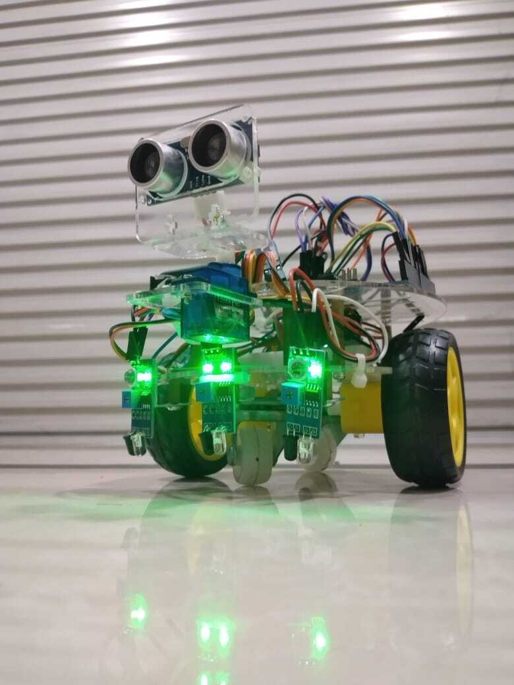

# Arduino Line Following & Obstacle Avoiding Robot

  

  A smart robot built with Arduino that skillfully follows a black line, detects obstacles in its path, navigates around them, and seamlessly returns to its course.

  

---

## 📝 Table of Contents
- [Project Overview](#-project-overview)
- [Hardware Requirements](#-hardware-requirements)
- [Circuit Diagram](#-circuit-diagram)
- [Simulation](#-simulation)
- [How It Works](#-how-it-works)
- [Getting Started](#-getting-started)
- [Important Note on Tuning](#-important-note-on-tuning)
- [References](#-references)

---

##  Project Overview

The goal of this project is to build and program a versatile robot car using the Arduino platform. This robot is designed with two primary functions: **line following** and **obstacle avoidance**. It uses infrared (IR) sensors to track a black line on a surface. If an obstacle is detected by the ultrasonic sensor, the robot will stop, scan for the clearest path, navigate around the object, and then intelligently search for the line to continue its journey.

This repository provides the complete source code, circuit diagrams, and library information needed to replicate the project.

---

## 🛠️ Hardware Requirements

Here is the list of components needed to build the full line-following and obstacle-avoiding robot. For a simple line-follower, you can omit the ultrasonic sensor, servo, and holder.

-   **Controller:**
    -   [x] 1x Arduino Uno
-   **Sensors:**
    -   [x] 2x Infrared (IR) Sensors (3-5 recommended for better accuracy)
    -   [x] 1x Ultrasonic Sensor HC-SR04
-   **Actuators & Motors:**
    -   [x] 2x DC Gear Motors (e.g., 12V)
    -   [x] 2x Wheels
    -   [x] 1x Servo Motor SG90
    -   [x] 1x L298N Motor Driver Module
-   **Power:**
    -   [x] 1x 9V Battery or 2x 18650 Li-ion Cells or 4x 1.5V AA Batteries
    -   [x] 1x Corresponding Battery Clip/Holder (preferably with a switch)
-   **Chassis & Misc:**
    -   [x] 1x Robot Car Chassis
    -   [x] 1x Holder for Ultrasonic Sensor
    -   [x] 1x On/Off Switch (if not included with the battery holder)
    -   [x] Male-to-Male & Male-to-Female Jumper Wires

---

## 🔌 Circuit Diagram

This schematic shows the complete wiring for the project, connecting the sensors, servo, and motors to the Arduino board via the L298N motor driver.

  

---

## 🤖 Simulation

The following GIF demonstrates the robot's logic in a simulated environment, showing its ability to follow a path and maneuver around walls.

  

---

## ⚙️ How It Works

1.  **Line Following:** The two IR sensors are placed on either side of the line.
    -   If the **left sensor** detects the line, the robot turns **left**.
    -   If the **right sensor** detects the line, the robot turns **right**.
    -   If **both sensors** are on the white surface, the robot moves **forward**.
2.  **Obstacle Avoidance:**
    -   The ultrasonic sensor constantly measures the distance to objects ahead.
    -   If an object is detected within a set threshold, the robot stops.
    -   The servo motor rotates the ultrasonic sensor to scan for the clearest path (left or right).
    -   The robot turns in the direction with more free space, moves forward to clear the obstacle, and then turns back to find the line.

---

## 🏁 Getting Started

1.  **Assemble the Hardware:** Build the robot chassis and mount all the components (motors, wheels, Arduino, sensors, etc.).
2.  **Wire the Circuit:** Connect all the components according to the [circuit diagram](#-circuit-diagram).
3.  **Upload the Code:**
    -   Install the [Arduino IDE](https://www.arduino.cc/en/software).
    -   Download the `.ino` sketch file from this repository.
    -   Open the sketch in the Arduino IDE, connect your Arduino Uno via USB, and upload the code.
4.  **Power Up:** Connect the battery pack and turn on the switch to start the robot.

---

## 🔧 Important Note on Tuning

**The `delay()` values in the code are critical for performance.** These values control the duration of motor actions like turning and moving forward. The ideal delay depends heavily on:
-   The **voltage and current** supplied by your batteries.
-   The **speed and torque** of your specific DC motors.
-   The **friction** of the surface the robot is on.

You **must experiment and tune** these `delay()` parameters to achieve smooth and accurate movements for your specific build. Start with the provided values and adjust them up or down until the robot behaves as expected.

---

## 📚 References
- **Arduino Project Hub:** [Line Follower Robot](https://create.arduino.cc/projecthub/embeddedlab786/line-follower-robot-d22d06) - An excellent foundational guide for the line-following concept.
